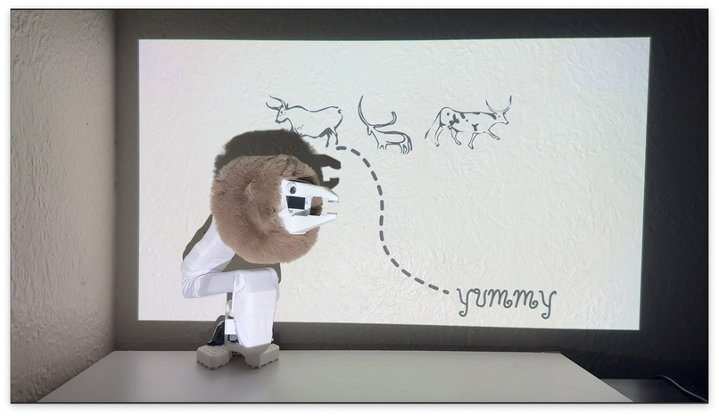
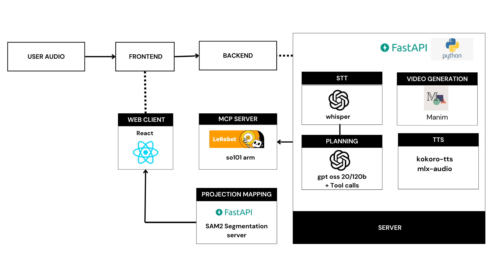
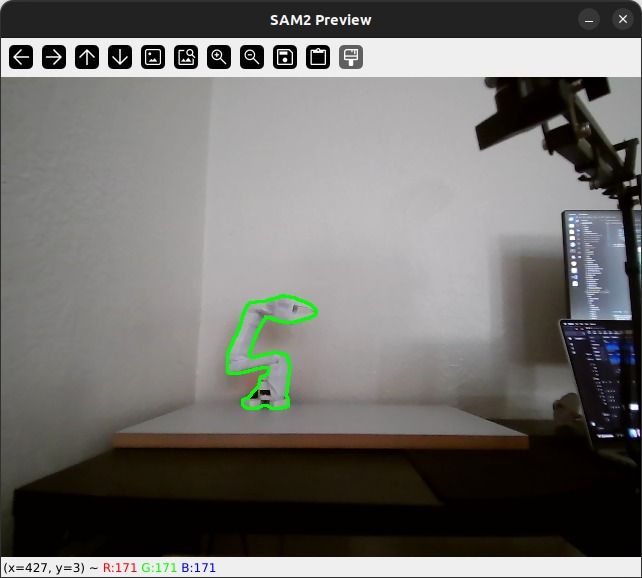

### Mythos

Robot-driven storytelling and visualization. The backend accepts audio input via mlx-audio. A Whisper-based SST model transcribes the audio and generates a structured plan (script + Manim instructions) using an LLM, renders TTS with Kokoro (mlx-audio), compiles a Manim video, and exposes assets to the frontend. A physical robot arm is controlled via MCP server tool calls from the LLM.


---

video demo: https://youtu.be/rmejZt_Lu2k?si=TbuhNQ2-8Sc40aVQ

Pipeline Components:
1. STT: Whisper(mlx-whisper)
2. LLM: GPT-OSS 120b(groq-api)
3. TTS: Kokoro(mlx-audio)
4. Manim: Manim Community 0.19
5. Robot: SO101 Follower(lerobot) via MCP server
6. Backend: FastAPI
7. Frontend: React



---
Two additional servers extend the core functionality:

- MCP server for robot control : `https://github.com/ankithreddypati/so101arm-mcp`
  

- Projection mapping: `https://github.com/ankithreddypati/sam2_projection_mapping`
  


### Prerequisites
- Python 3.11+ and a recent `pip` or `uv` (recommended)
- Node 18+ for the frontend
- ffmpeg (needed by audio/whisper): `brew install ffmpeg`
- Manim Community 0.19 (installed via backend requirements) : `brew install manim`
- macOS with Apple Silicon recommended for `mlx-*` packages

If using the robot so100/so101 arm:
- USB connection to the robot

---

### Environment variables
Create a `.env` file in `backend/` with at least:

```
GROQ_API_KEY=your_groq_key
LLM_MODEL=openai/gpt-oss-120b
# Optional tuning for manim video duration
TARGET_DURATION_S=30
# Optional: pin a custom whisper repo
WHISPER_REPO=mlx-community/whisper-small.en-mlx-q4
MCP_SERVER_URL=http://127.0.0.1:8001
```

---

### Backend setup and run

```
cd backend
# If you use uv (recommended)
uv init
uv install -r requirements.txt
```

If you prefer pip/venv:

```
python -m venv .venv
source .venv/bin/activate
pip install -r requirements.txt
```

Run the API server:

```
uv run uvicorn server:app --host 0.0.0.0 --port 8000 --reload
# or, with pip env:
uvicorn server:app --host 0.0.0.0 --port 8000 --reload
```

Assets are saved under `backend/renders` and served at `/assets/...`.


---

### Frontend setup and run

put the backend url and socket url(projection mapping server) in the frontend .env.local file:

VITE_BACKEND_URL=XXX
VITE_SOCKET_URL=XXX


```
cd frontend
npm install
npm run dev
```


---

Create a `.env.local` in `frontend/` with:

```
# Projection mapping server/websocket (if used)
VITE_SOCKET_URL=http://10.0.0.45:5001/
# Backend FastAPI URL
VITE_BACKEND_URL=http://127.0.0.1:8000
```
---

### API overview
- POST `/render`
  - Body JSON: `{ prompt, voice, lang_code, speed, reasoning_effort }`
  - Returns: `{ job_id, plan, robot_actions,audio_url, video_url?, video_status, video_error? }`
  - Audio is always rendered. Video is best-effort via Manim.

- POST `/transcribe`
  - Form fields: `file` (UploadFile), optional `whisper_repo`, `language`, `word_timestamps`, `temperature`
  - Uses `mlx-whisper`; requires `ffmpeg`.

---

### Few Notes
- Manim scene requirements are validated/sanitized after testing LLM ouput; see `safe_prepare_manim_code` in `backend/server.py`.
- TTS uses Kokoro via `mlx-audio`; see `get_kokoro` and `render_tts`.
- Renders directory can be opened by the frontend at `/assets/...`.

---

### Future Work
YOLO object detection → LLM decides what to highlight → SAM2 segments → projection tracks to make the scene more interactive and engaging.